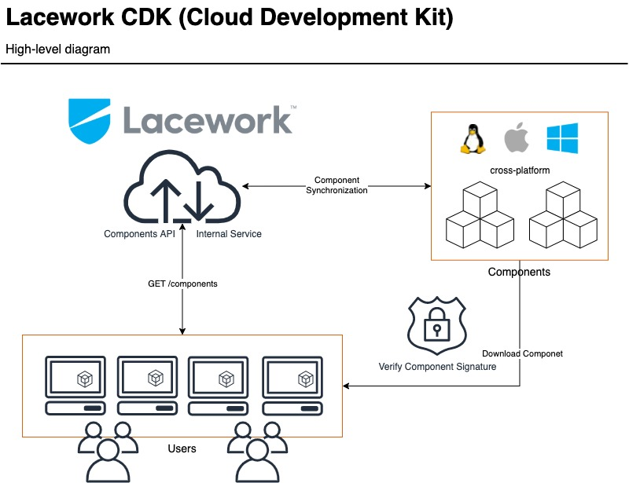

# Lacework CDK (Cloud Development Kit)

Proposed by: [Salim Afiune Maya](https://github.com/afiune)

As the Lacework platform grows and introduces new products and services, our security ecosystem will
have to grow at the same speed (or even faster) to adopt such new products. This design is a proposal
for adopting a new model to deliver tools and libraries to Lacework users.

## Motivation

The Lacework CLI was designed with the goal of providing fast, accurate, and actionable insights into
the Lacework platform. The first release [v0.1.0](https://github.com/lacework/go-sdk/releases/tag/v0.1.0) was on March 27, 2020, and since then, the Lacework CLI
has been broadly adopted. A year later, Lacework released a couple more binaries, and today, it is clear
to us that we will adopt this model of releasing separate binaries for more products and services in the
future.

This model of modular binaries is flexible and will allow us to release features faster to our users,
but it also lacks a cohesive ecosystem, an easy way for users to discover, install, configure and
manage all of these tools.

This design aims to solve this problem by introducing the concept of **components** into the Lacework CLI,
with these new components, the Lacework CLI will evolve into the SDK realm and therefore, we are proposing
to name it the Lacework CDK (Cloud Development Kit) since it will now provide truly a combination of
tools and libraries to build a robust and flexible ecosystem for our users.

## Scope

The main goal of this design is to introduce the concept of components to build a flexible and robust ecosystem
around the Lacework platform.

This design also aims to:

* Unify the installation and configuration of tools provided by Lacework
* Help users discover new tools from new Lacework products
* Provide the same experience for managing components
* Allows users to create new tools to enhance security workflows
* Make it easy to manage and distribute libraries and content

## High-level Diagram

## What Are Components?

A component can be a command-line tool, a set of Lacework commands, or a package that contains dependencies
used by another Lacework component.

### Component Specifications

Every component should follow the following specifications:

| Name           | Type               | Description                                                                                                                  |
| ------         | ---------          | -------------------------------------------------------------                                                                |
| `name`         | `string`           | The name of the component                                                                                                    |
| `description`  | `string`           | A long description of the purpose of the component                                                                           |
| `type`         | `enum(Type)`       | The component type (read more about types here)                                                                              |
| `version`      | `string`           | The version of the component in semantic format (`MAJOR.MINOR.PATCH`) (different from the overall components specifications) |
| `size`         | `int64`            | The component size in bytes                                                                                                  |
| `checksum`     | `string`           | SHA256 (256-bit) checksums of the component                                                                                  |
| `download_url` | `string`           | The URL from where to download the component                                                                                 |
| `dependencies` | `array(Component)` | A list of components that the component depends on                                                                           |

These specifications should not be hardcoded, they should be designed to be extensible since they will change as we
expand the usage and purpose of these components.

The specifications from all registered components will be provided by a new components service which will have
a semantic version (`MAJOR.MINOR.PATCH`) so that when the specifications change, a new version will be released
and our users will get notified.

### Components Internal Service

We should have a very lightweight service that will be the single source of truth of all available Lacework components,
this service should fulfill the following use cases:

* Provide an API to fetch the current state of all Lacework components and their specifications
* Provide an API to define (create) new components, when new components are added to this service, our users will be notified automatically
* Provide an API to deprecate a component, read more about deprecations below
* Provide an API to trigger a sync of a single component, useful for orchestrating release pipelines 
* Configure a batch process that runs every 10 minutes to verify that all components are in sync

### Component Synchronization

A component synchronization is a task that the internal components' service does to verify the latest version of one
or multiple components, when there is a new version of a component, this task updates the description, version, size,
checksum, and dependencies of the component.

Note that changing the type of the component is discouraged.

### Signature And File Checksum

As a security company, we need to ensure that any binary we install on our users' workstation is coming from us, the
installation and upgrade process will have a requirement that every component should be signed with Lacework's PGP
key, if the downloaded component doesn't match the PGP signature, we should delete the downloaded binary and
notify the user.

A second safety we should have is to check the SHA256 (256-bit) checksums of the downloaded binary or compressed file
which should match with the one provided by (APIs) the new components internal service.

### Create A New Component 

To create a new component, we need to define the following things:

* Define the component type (binary, commands, or content)
* For binary components, have cross-platform binaries (support windows, linux and osx)
* Automate the release process via CD pipelines
* Make the first release of the new component
* Add the component to our components internal service (this is when users will discover the new component)

## Attribution to third-party tools

A component can be a third-party tool that helps users enable specific workflows such as infrastructure-as-code.
During the installation and upgrade of these types of components, we need to give attribution by including the
copyright and permissions statement.

One example of a third-party tool we use today is [Terraform](https://github.com/hashicorp/terraform), which allows
Laceworks' users to follow the GitOps methodology by configures their Lacework accounts as code.

Lacework believes in a growing open-source community, we envision the adoption of other third-party tools that will
help our users to improve their security postures when they complement it with the Lacework platform.

## Deprecations

We aim to adopt this robust ecosystem of tools to release new products, features, bug fixes, and functionalities to
our users as fast as possible, with that speed, there will be times where we will release pieces of a component, or
even an entire component that might not be well received by our users, in those cases our deprecation policy will be:

* Mark the flag, command, functionality, or component as deprecated
* Communicate to our users about the deprecation
* Wait for 90 days until removal
* Remove the deprecation and release with a major version bump

## Telemetry and Observability

We use [Honeycomb](https://www.honeycomb.io/) as our platform to understand how our customers are adopting tools
and integrations we build. Today, it allows us to detect early on when customers are experiencing issues, what
are the most used commands, what are the most common errors our users are experiencing, and more.

When implementing this component-based model, we need to add end-to-end observability to trace requests that are
initiated at the command line and go all the way to our backend. This means that every component will need to
have the instrumentation to send telemetry to Honeycomb, as well as passing the correct tracing information to
the underlying API endpoint.

Internally, our API server should accept this tracing information and propagate it to subsequent requests to internal
services, this will allow us to group all of these requests in a single transaction or trace.

## Open Questions:

* Will there be components that don't have cross-platform support? If yes, document examples and additional details about how to handle these cases
* ...

